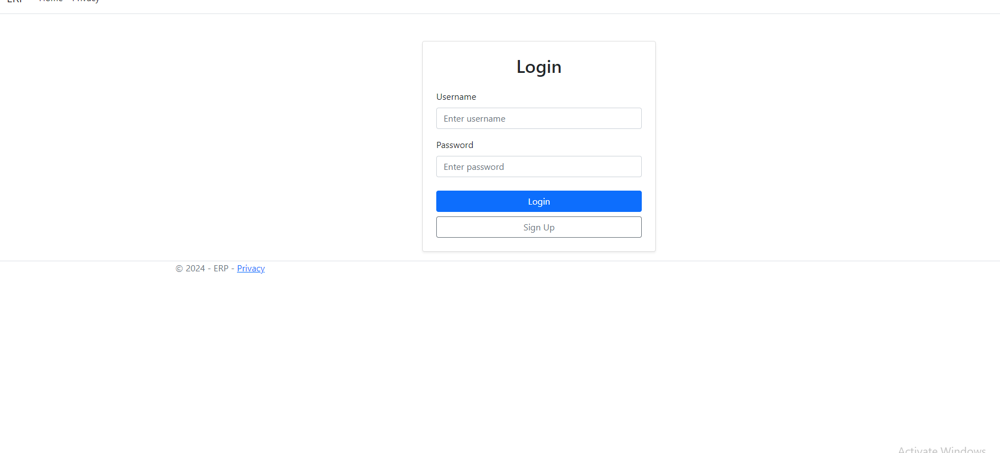
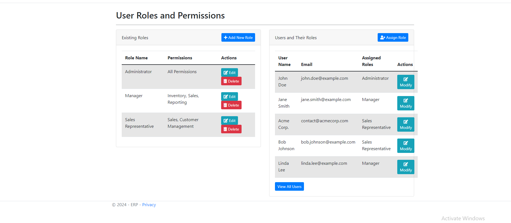
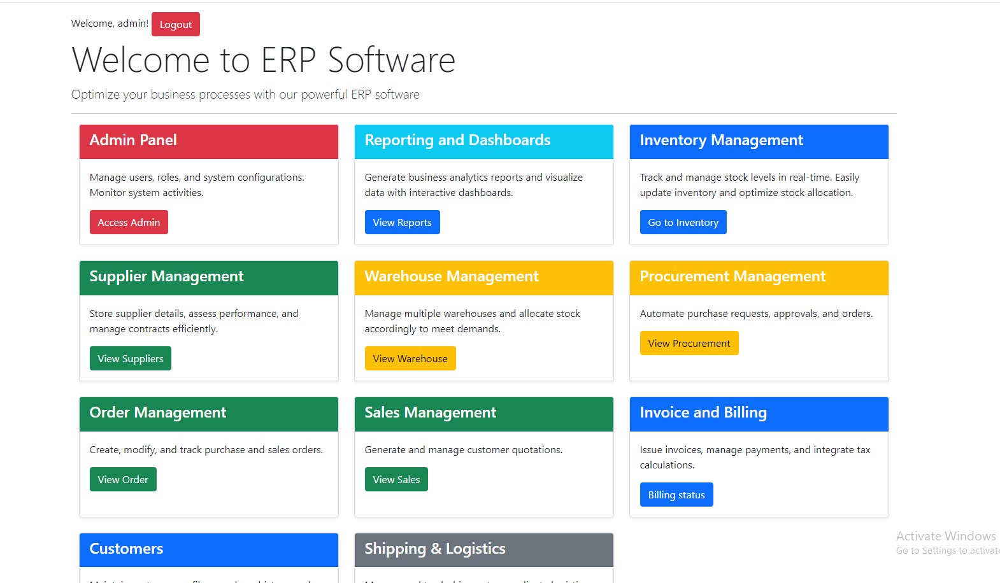
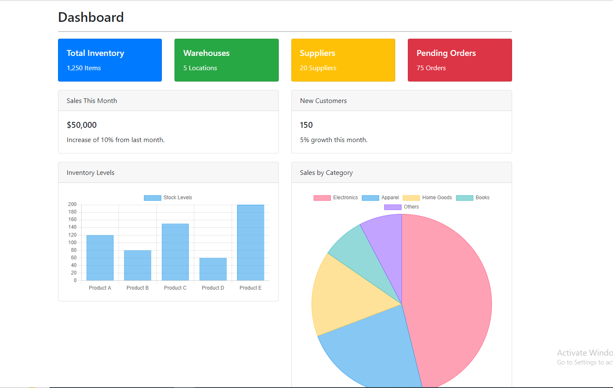
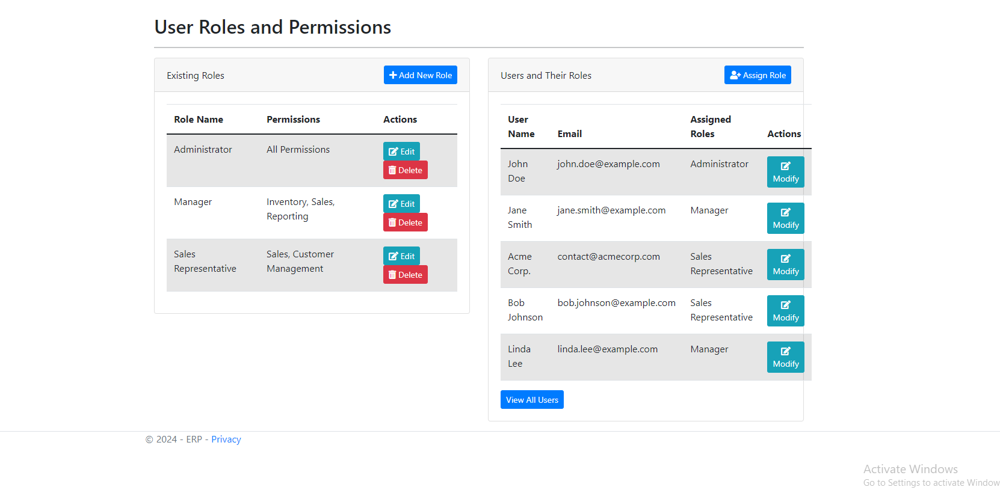

# Project Modules and Functional Requirements (ERP Software for E-commerce)

| **Number** | **Module**                        | **Functional Requirements**                                                                                                                                                                         |
|------------|------------------------------------|-----------------------------------------------------------------------------------------------------------------------------------------------------------------------------------------------------|
| 1          | **Inventory Management Module**   | **Inventory Management**: Track stock levels and update in real-time.<br>**Warehouse Management**: Manage multiple warehouses and their stock allocation.<br>**Supplier Management**: Store supplier details, assess performance, and manage contracts.<br>**Procurement Management**: Automate purchase requests, approvals, and orders. |
| 2          | **Sales & Customer Management Module** <br>(Overview of sales data) | **Order Management**: Create, modify, and track purchase and sales orders.<br>**Sales Quotation**: Generate and manage customer quotations.<br>**Invoicing and Billing**: Issue invoices, manage payments, and integrate tax calculations.<br>**Customer Management**: Maintain customer profiles, purchase history, and support tickets. |
| 3          | **Analytics and Reporting Module** | **User Roles and Permissions**: Define access levels for users.<br>**Reporting and Dashboards**: Generate business analytics reports.<br>**Shipping and Logistics**: Manage shipment tracking, carrier assignments, and delivery status.<br>**Notifications and Alerts**: Set up email/SMS notifications for key events.<br>**System Integration** (Optional): Integrate third-party APIs (e.g., payment gateways, CRM tools). |


# Team Members

1.  Soumik Deb Niloy 
2.  Shaownak Shahriar
3.  Debjoty Mitra

# Run this project

```
git clone <copy link from the codebar and paste>
```
```
cd ERP
```
```
dotnet run
```

Interfaces





